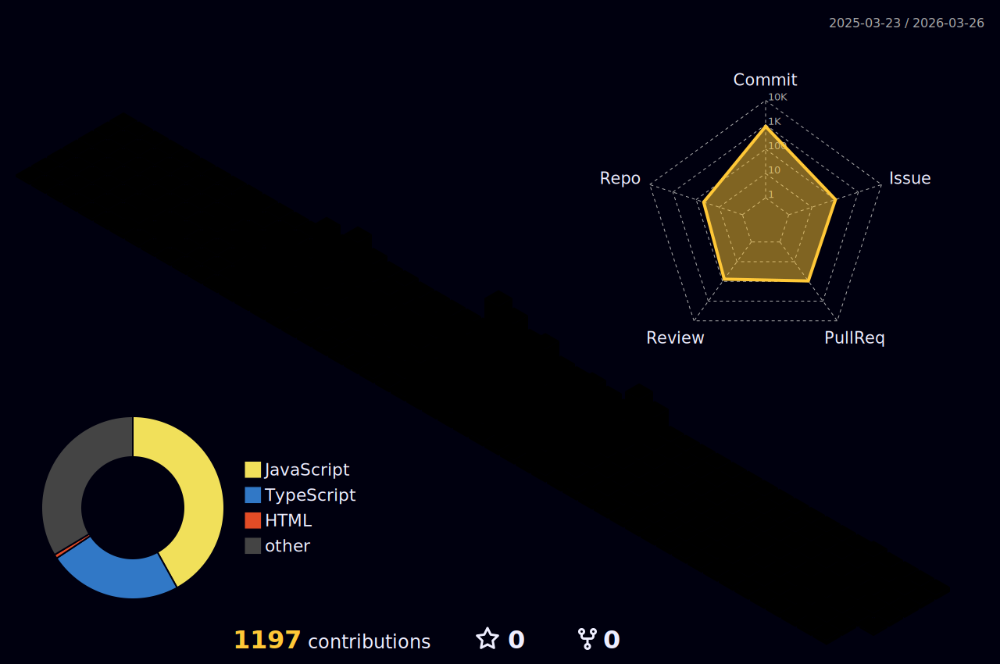

<h1> Hyerim Woo </h1>
 

<h3 align="center">
- 🌱 I’m currently learning 
</h3>
 

</a>&nbsp
</a>&nbsp

<h3 align="center">
- 💻 Tech Stack
</h3>
 

</a>&nbsp
</a>&nbsp
</a>&nbsp

 
 

<!--
**rimi-w/rimi-w** is a ✨ _special_ ✨ repository because its `README.md` (this file) appears on your GitHub profile.

Here are some ideas to get you started:

- 🔭 I’m currently working on ...
- 🌱 I’m currently learning ...
- 👯 I’m looking to collaborate on ...
- 🤔 I’m looking for help with ...
- 💬 Ask me about ...
- 📫 How to reach me: ...
- 😄 Pronouns: ...
- ⚡ Fun fact: ...
-->
